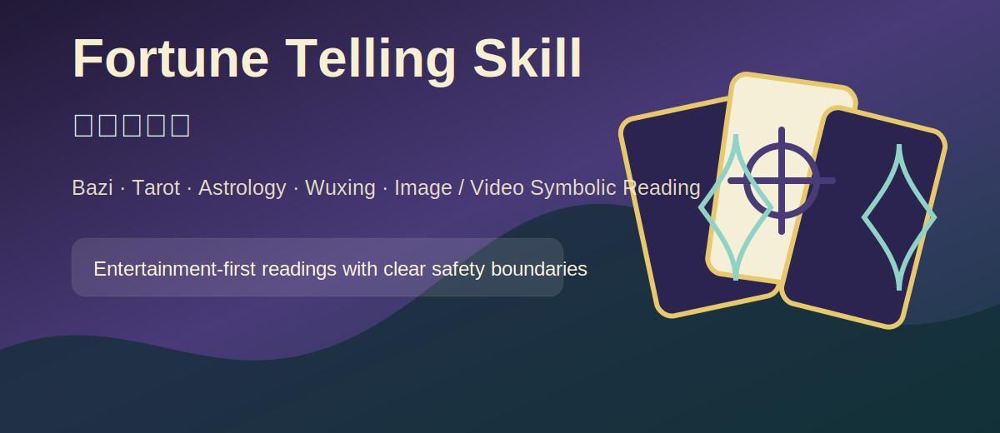
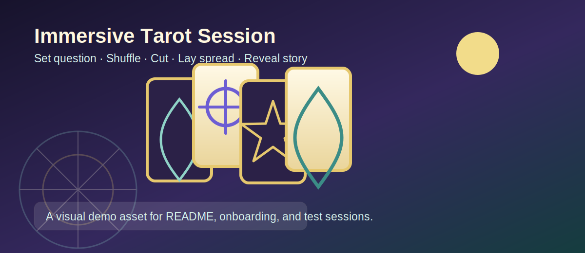
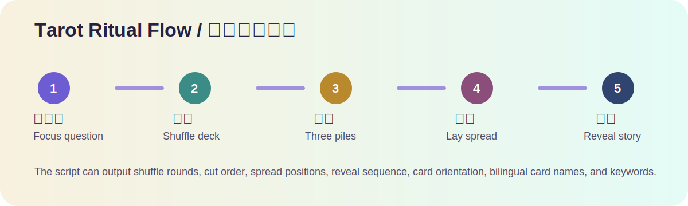
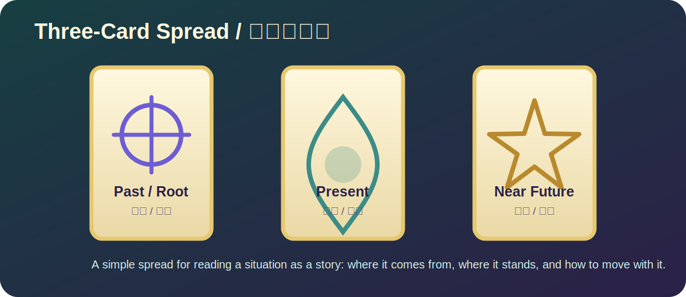
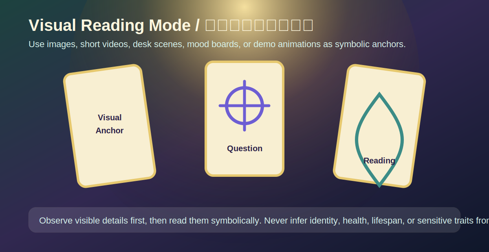

# Fortune Telling Skill / 灵感算命师



一个面向 Codex 的娱乐性命理与象征解读 skill，把八字、五行、塔罗、星座、流年主题和图片/视频取象结合成一次更有仪式感的对话体验。

它不是用来“证明命运”的工具，而是把民俗语言、牌面象征、元素意象和用户提供的生活处境组织成一面镜子：帮助用户看见当下的主题、情绪、选择和可能的行动方向。

> For entertainment, folklore-inspired reflection, and creative conversation only.  
> 不替代医学、法律、财务、安全、心理健康等重大决策中的专业建议。



---

## 它能做什么

- **八字 / 生辰八字 / 五行分析**  
  基于用户提供的出生信息或四柱，做五行倾向、元素流动、优势与卡点的象征性分析。

- **塔罗牌解读**  
  支持单张牌、三张牌、关系牌阵、岔路牌阵、凯尔特十字等形式，并内置可复现的抽牌脚本。现在也支持更接近真实塔罗会话的流程：定问题、洗牌、切牌、发牌、逐张翻牌和综合解读。

- **星座 / 占星风格分析**  
  支持太阳星座轻量解读，也可以基于用户提供的星盘配置做更细的性格、关系和阶段主题分析。

- **流年、事业、感情、财运主题解读**  
  用“主题-机会-提醒-行动”的结构，把抽象运势转成更容易理解和执行的建议。

- **图片 / 视频 / 空间 / 物件取象**  
  可以根据用户上传的图片、视频关键帧、房间、桌面、物件、穿搭或截图进行象征性解读。

- **沉浸式测试与展示**  
  用户可以附上图片、短视频、截图、动画或氛围图，让 skill 先按画面取象，再像真人咨询一样追问、定问题、洗牌、切牌和解读。

- **对话式算命体验**  
  它会像真人咨询一样先校准问题、了解背景、推荐牌阵或解读方法，再进入洗牌、切牌、发牌和分层解读。

---

## 适合谁使用

这个 skill 适合：

- 想做一次有氛围感的娱乐性算命体验
- 想用塔罗或五行语言整理最近的困惑
- 想把事业、感情、财运问题转成更清晰的反思方向
- 想让 AI 根据图片、视频或空间画面做“取象”式解读
- 想创建一个有边界、有安全提醒、不搞宿命论的算命助手

它不适合：

- 用来决定是否治疗、投资、诉讼、辞职、结婚、怀孕、移民等重大事项
- 用来替代医生、律师、财务顾问、心理咨询师或安全专业人员
- 用来从照片里判断寿命、疾病、身份、性格定论或其他敏感信息

---

## 快速开始

把整个 `fortune-telling` 文件夹放到你的 Codex skills 目录中：

```text
C:\Users\Administrator\.codex\skills\fortune-telling
```

然后在 Codex 中这样使用：

```text
用 $fortune-telling 给我做一次塔罗解读，我想问未来三个月的事业。
```

或者：

```text
用 $fortune-telling 看一下我的八字和五行，我想重点看事业和感情。
```

如果当前会话没有立即识别新 skill，重开 Codex 会话或刷新技能列表后再试。

---

## 示例提示词

### 八字 / 五行

```text
用 $fortune-telling 看八字。
我是公历 1998 年 6 月 12 日晚上 9 点左右出生，出生地是杭州。
想看事业、感情和今年的整体节奏。
```

如果你已经有四柱，也可以直接给：

```text
用 $fortune-telling 根据「甲子 丙寅 辛巳 壬辰」做五行倾向分析。
```

### 塔罗

```text
用 $fortune-telling 抽三张塔罗。
问题：我是否适合今年换工作？
```

```text
用 $fortune-telling 做关系牌阵。
我想看我和对方现在的关系动态，以及接下来该怎么沟通。
```

```text
用 $fortune-telling 做一次完整塔罗流程。
请像真人塔罗咨询一样，先问我几个问题，再模拟洗牌、切牌、发牌和逐张翻牌。
问题：未来三个月我的事业重点是什么？
```

### 星座 / 占星

```text
用 $fortune-telling 做一个轻量占星解读。
我是天蝎座，最近想看感情和自我状态。
```

```text
用 $fortune-telling 根据这些星盘配置解读：太阳射手、月亮巨蟹、上升天秤、金星天蝎。
```

### 流年 / 事业 / 感情 / 财运

```text
用 $fortune-telling 看一下我 2026 年的事业运。
我现在处在想跳槽但还没决定的阶段。
```

```text
用 $fortune-telling 看一下我最近三个月的财运。
请重点看机会、风险和适合调整的地方。
```

### 图片 / 视频取象

```text
用 $fortune-telling 看这张照片的整体能量，重点看事业状态。
```

```text
用 $fortune-telling 根据这段视频做取象解读。
我想看最近的人际关系和情绪状态。
```

图片和视频解读会聚焦颜色、光线、构图、物件、动作、空间感和用户提供的背景，不会从外貌里推断健康、寿命、身份、财富或其他敏感信息。

### 沉浸式测试

```text
用 $fortune-telling 做一次沉浸式塔罗测试。
我会上传一张桌面照片，请你先按画面取象，再像真人咨询一样问我问题，最后洗牌切牌抽牌。
```

```text
用 $fortune-telling 做一次带动画氛围的塔罗演示。
请用洗牌动画的感觉开场，先问我问题，不要直接抽牌。
```

---

## 体验风格

这个 skill 追求的是一种“像真的算命过程，但不假装拥有绝对答案”的体验。

它会：

- 先定边界：这是娱乐性、民俗性、象征性的解读
- 像真人咨询一样先校准问题，而不是直接给结论
- 根据问题选择方法：八字、五行、塔罗、占星、取象或混合解读
- 只追问必要信息，不把用户困在长表格里
- 用具体画面和象征语言建立沉浸感
- 把结果整理成主题、机会、提醒和行动建议
- 在涉及高风险主题时提醒用户寻求专业意见

它不会：

- 说“你一定会发财”“对方一定会回来”“这件事命中注定”
- 编造不存在的精确八字、星盘、流年或医学/财务结论
- 从图片里判断疾病、寿命、犯罪倾向、身份、心理诊断或其他敏感特征
- 鼓励用户用算命结果替代现实决策

---

## 塔罗流程展示



完整塔罗模式会把一次读取拆成更有真实感的步骤：

1. **定问题**：把用户的问题收束成一句可读取的问题。
2. **洗牌**：模拟 78 张牌的多轮洗牌，作为注意力聚焦的仪式。
3. **切牌**：切成三叠，再按脚本生成的顺序重新合牌。
4. **发牌**：按照单张、三张、关系、岔路或凯尔特十字牌阵摆放。
5. **翻牌**：逐张揭示牌面，再把所有牌合成一个完整故事。



三张牌模式适合快速看一个问题的变化线：过去/根源、现在/挑战、未来趋势/建议。

---

## 沉浸式视觉模式



测试这个 skill 时，可以把图片、短视频或动画当作“桌面”和“氛围”来使用。它会先观察画面里的非敏感信息，例如颜色、光线、构图、物件、方向感和重复元素，再把这些内容作为象征锚点。

适合用来测试的素材：

- 一张桌面、房间、书桌、手账、牌桌或空间照片
- 一段短视频，或从视频里截出的 2-4 张关键帧
- 一张 mood board、穿搭图、物件图、截图
- README 里的 `assets/tarot-shuffle-animation.svg` 动画图

重要边界：图片和视频只用于氛围和象征解读，不用于判断身份、健康、寿命、财富、心理诊断或其他敏感信息。

---

## 内置脚本

### Tarot draw

`scripts/draw_tarot.py` 可以抽取塔罗牌，并输出 JSON：

```bash
python scripts/draw_tarot.py --spread three-card --question "我接下来三个月的事业状态如何？"
```

也可以用完整仪式模式输出 Markdown：

```bash
python scripts/draw_tarot.py --ritual --spread three-card --format markdown --question "我接下来三个月的事业状态如何？"
```

支持的牌阵包括：

- `single`
- `three-card`
- `mind-heart-action`
- `relationship`
- `crossroads`
- `celtic-cross`

### Wuxing balance

`scripts/wuxing_balance.py` 可以根据天干地支做五行数量统计：

```bash
python scripts/wuxing_balance.py "甲子 丙寅 辛巳 壬辰"
```

它会输出可见五行、藏干五行、总计分布、偏强元素和偏弱元素。注意，这只是五行象征统计，不是完整排盘工具。

---

## 文件结构

```text
fortune-telling/
├── SKILL.md                         # Codex 实际读取的 skill 说明与触发规则
├── README.md                        # GitHub 展示文档
├── agents/
│   └── openai.yaml                  # UI 展示信息
├── assets/
│   ├── README-cover.svg             # README 封面图
│   ├── immersive-reading-table.svg  # 图片/动画沉浸测试展示图
│   ├── oracle-icon.svg              # skill 图标
│   ├── tarot-shuffle-animation.svg  # 动态洗牌展示图
│   ├── tarot-ritual-flow.svg        # 塔罗流程展示图
│   └── three-card-spread.svg        # 三张牌牌阵展示图
├── references/
│   ├── astrology.md                 # 占星解读边界与基础语言
│   ├── bazi-wuxing.md               # 八字、天干地支、五行参考
│   ├── fortune-topics.md            # 流年、事业、感情、财运主题结构
│   ├── immersive-testing.md         # 沉浸式图片/动画测试流程
│   ├── multimedia-reading.md        # 图片/视频取象规则
│   ├── response-patterns.md         # 输出模板
│   ├── safety-and-ethics.md         # 安全边界与隐私规则
│   ├── session-design.md            # 对话流程和仪式感设计
│   ├── tarot-ritual.md              # 洗牌、切牌、发牌、翻牌流程
│   └── tarot.md                     # 塔罗牌阵与牌义参考
└── scripts/
    ├── draw_tarot.py                # 塔罗抽牌脚本
    └── wuxing_balance.py            # 五行统计脚本
```

---

## 安全边界

本 skill 的所有解读都应被理解为：

- 娱乐性
- 民俗性
- 象征性
- 自我反思式
- 对话辅助式

它不能替代：

- 医生或心理健康专业人士
- 律师或法律顾问
- 财务顾问或投资决策
- 紧急安全判断
- 任何高风险人生决策

推荐表达方式是：

```text
从象征上看，这更像是一种趋势，不是定论。
```

不推荐表达方式是：

```text
这件事一定会发生。
```

---

## Repository Description

GitHub 仓库简介可以使用这一句：

```text
A Codex skill for entertainment-oriented fortune telling, supporting Bazi, five-element analysis, tarot, astrology-style readings, yearly luck, career, love, wealth, and image/video symbolic interpretation, with clear safety boundaries for medical, legal, financial, and other major decisions.
```

---

## License

Choose a license before publishing if you want others to reuse or modify this skill. MIT is a common choice for small open-source tools.
